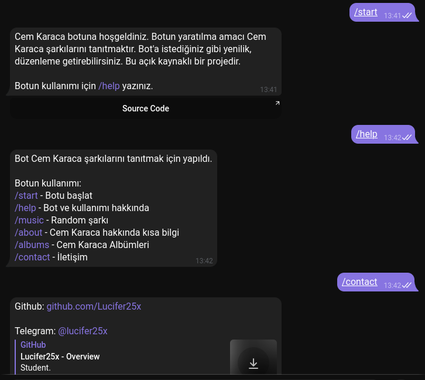
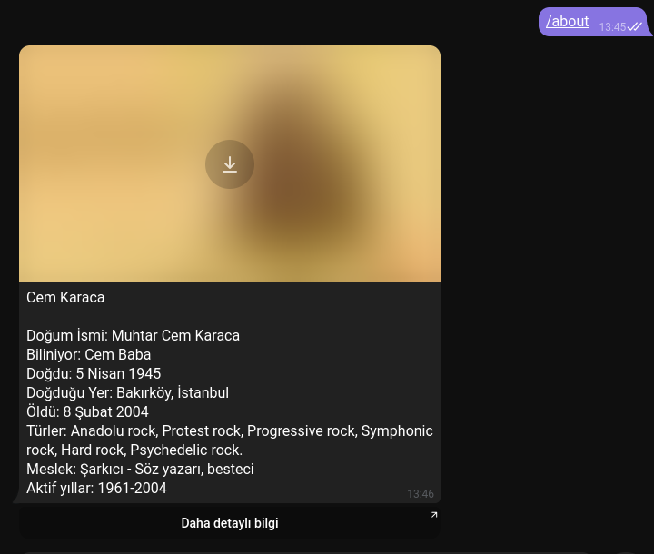
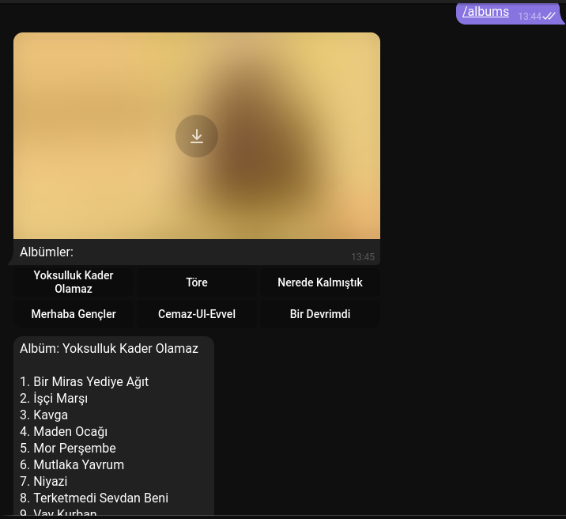
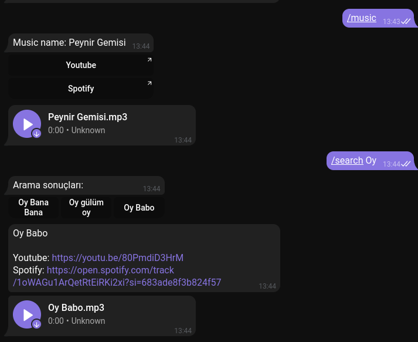

# Cem Karaca Telegram botu
| Bot Cem Karaca şarkılarını tanıtmak için yapıldı.

Bot: https://t.me/cem_karaca_bot

## Botun kullanımı:
* /start - Botu başlat
* /help - Bot ve kullanımı hakkında
* /music - Random şarkı
* /about - Cem Karaca hakkında kısa bilgi
* /albums - Cem Karaca Albümleri
* /contact - İletişim
* /search - Şarkı aramak için

## Bot features:
* Download song (mp3)
* Search song
* Get random song
* Get information about Cem Karaca
* Get thumbnail photo (if thumbnail photo is available)
* Get Cem Karaca Albums

### Şu anlık api'de sadece 155 Cem Karaca müziği bulunuyor. Kendi bildiğim şarkılarını eklemeye çalıştım. Ama bilmediğim şarkıları da olabilir. Eğer bir yenilik eklemek veya düzenleme yapmak istiyorsanız lütfen PR atınız. 

### Kendi botunu yap:
* .env dosyası yaratıp `env-example.txt` dosyasındakı tarzda kod yazın. Kodda botunuzun token'ini belirtmeniz gerekiyor.
*  `npm install` komutunu terminalinizde yazarak gerekli bazı kütüphaneleri indirebilirsiniz.
*  Botu çalışır hale getirmek için terminalinizde `npm start` yazmalısınız.

#### Eğer herhangi bir öneriniz ve s. varsa issues kısmından belirtebilirsiniz.

### ScreenShots

